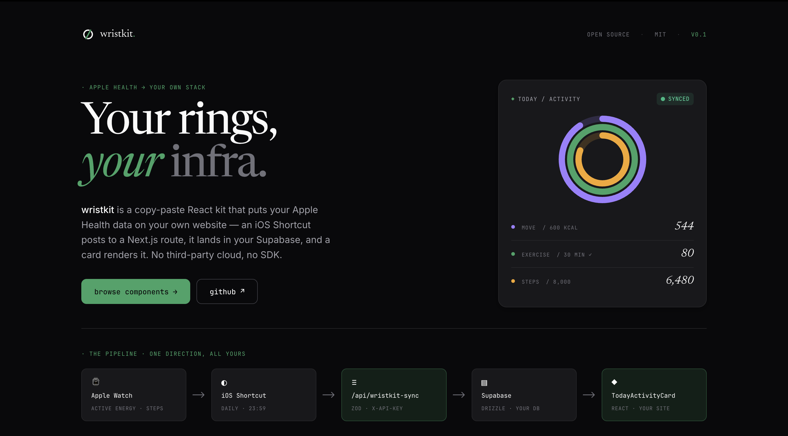

# wristkit

**Apple Health data on your website — in minutes.**



A CLI that drops production-ready React components for visualizing Apple Health data into any Next.js project. You bring your own Supabase. Zero telemetry. MIT.

```bash
npx wristkit init
```

## What it does

- `npx wristkit init` — detects your Next.js app, writes `components.json` and `.env.local.example`, prints the SQL migration to run in Supabase
- `npx wristkit add today-activity-card` — copies the component files into your project
- Import the iOS Shortcut on your iPhone, edit two fields (URL + API key), done
- Your Apple Watch rings render on your site, live, from your own Supabase — we never see your data

## Quick start

```bash
# 1. Initialize
npx wristkit init

# 2. Run the SQL migration in your Supabase SQL editor (printed by init)

# 3. Add the component
npx wristkit add today-activity-card

# 4. Use it in a Server Component
import { TodayActivityCard, loadTodayActivity } from "@/components/wristkit/today-activity-card"

export default async function Dashboard() {
  const state = await loadTodayActivity()
  return <TodayActivityCard state={state} />
}

# 5. Set up the iOS Shortcut
npx wristkit shortcut
```

## Requirements

- Next.js 15+ (App Router)
- A [Supabase](https://supabase.com) project (free tier works)
- Node.js ≥ 20

## Documentation

Full docs at **[wristkit-web.vercel.app/docs](https://wristkit-web.vercel.app/docs)**

- [Installation](https://wristkit-web.vercel.app/docs/installation)
- [iOS Shortcut setup](https://wristkit-web.vercel.app/docs/shortcut-setup)
- [TodayActivityCard](https://wristkit-web.vercel.app/docs/components/today-activity-card)
- [Component states](https://wristkit-web.vercel.app/docs/concepts/component-states)

## Privacy

wristkit is a CLI + component library. Your data flows directly from your iPhone to your Supabase — we never see it, store it, or have access to it. No analytics SDK. No server-side logging. No third-party cloud.

## Development

```bash
pnpm lint
pnpm typecheck
pnpm test
pnpm build
```

## License

MIT — see [LICENSE](./LICENSE)
