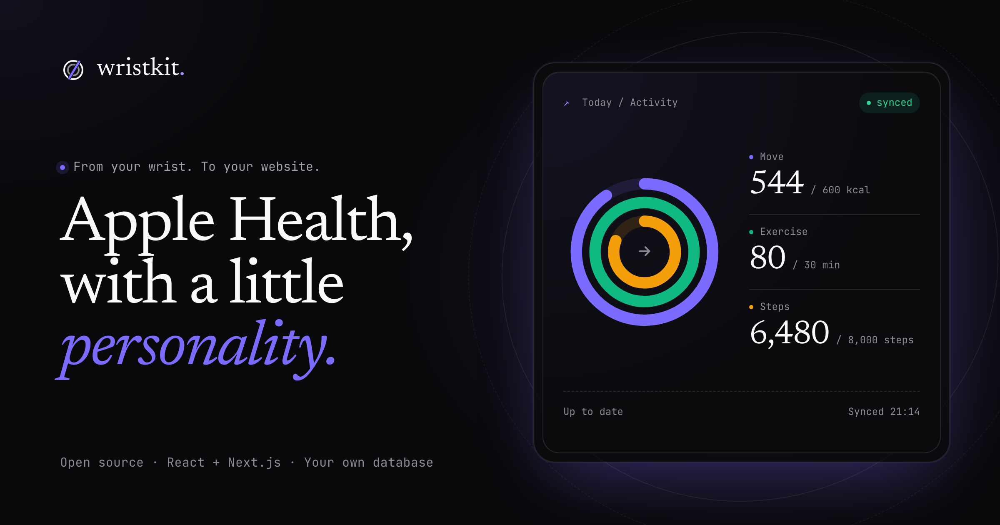

<p align="center">
  
</p>

<p align="center">
  <a href="https://wristkit-web.vercel.app">Live</a> ·
  <a href="https://wristkit-web.vercel.app/docs">Docs</a> ·
  <a href="https://wristkit-web.vercel.app/docs/installation">Installation</a> ·
  <a href="https://wristkit-web.vercel.app/docs/shortcut-setup">Shortcut</a> ·
  <a href="https://entrepta.vercel.app">entrepta</a>
</p>

<p align="center">
  <a href="https://github.com/imnotannamaria/wristkit/actions/workflows/ci.yml"></a>
  
  
  
</p>

# wristkit

Apple Health, with a little personality. wristkit is an Activity Card for your Next.js site: move, exercise and steps from your Apple Watch, drawn as three rings, in whatever theme your site already wears.

It is not an npm package and not a hosted service. You copy a handful of files into your project, run two SQL migrations in your own Supabase, and add an iOS Shortcut to your iPhone. Your activity goes from the phone to your database and nowhere else. wristkit never receives it, and there is no telemetry.

## How it works

```
Apple Watch → Apple Health → iOS Shortcut
                                  │  POST { steps, moveKcal, exerciseMin }
                                  │  header x-api-key
                                  ▼
                    your /api/wristkit-sync route
                                  │  one row per metric
                                  ▼
                 your Supabase: wristkit_samples
                                  │
                                  ▼
         loadTodayActivity() → <TodayActivityCard state={state} />
```

The route compares the API key in constant time, rejects bodies over 256 KB, and rate limits by IP. The loader runs on the server and hands the card a state. The card never fetches: it renders one of five states, `loading`, `empty`, `error`, `stale` (no sync for more than 24 hours) and `ok`, each with its own design.

## What's inside

This repo is the source of every file you copy, plus the site that documents them.

| Page | What it is |
| --- | --- |
| `/` | The hero and an interactive preview of the card in all five states |
| `/docs` | Where to start, and how the pieces fit |
| `/docs/installation` | The full setup. Every code block is read from `packages/registry` at build time |
| `/docs/shortcut-setup` | Adding and configuring the Shortcut, with screenshots |
| `/docs/components/today-activity-card` | The card, its states and its props |
| `/docs/concepts/*` | The state contract, the data model and how the registry works |
| `/docs/faq` | The questions that come up |
| `/shortcut` | The `.shortcut` file, served with the MIME type Safari hands to the Shortcuts app |

Six themes in dark and light, a skip link, reduced motion support and a home page that reads fine without JavaScript come with the site. The card itself ships with its own stylesheet, so it looks right in a project that has never heard of entrepta.

## Add it to your site

You need Next.js 15 or newer with the App Router, Node.js 20 or newer, a [Supabase](https://supabase.com) project (the free tier is enough) and an iPhone with Apple Health data.

### 1. Install

```bash
pnpm add drizzle-orm postgres zod
```

### 2. Environment

Add two variables to `.env.local` and to your host's server environment:

```bash
WRISTKIT_DATABASE_URL=your-supabase-transaction-pooler-url
WRISTKIT_API_KEY=your-random-secret
```

`WRISTKIT_DATABASE_URL` is the **Transaction pooler** string from the Supabase connection dialog, on port 6543. The direct connection does not resolve from serverless functions on Vercel. `WRISTKIT_API_KEY` is a secret you make up; the Shortcut sends it on every sync. Generate one with:

```bash
node -e 'console.log(require("crypto").randomBytes(32).toString("base64url"))'
```

Neither variable gets a `NEXT_PUBLIC_` prefix. Both stay on the server.

### 3. Database

Run [`0001_initial.sql`](packages/registry/schemas/0001_initial.sql) and then [`0002_dedupe.sql`](packages/registry/schemas/0002_dedupe.sql) in the Supabase SQL editor. The first creates `wristkit_samples` and its indexes; the second adds the unique index that keeps a re-run of the Shortcut from counting twice. If your table already holds duplicates, the second file explains how to clean them up first.

### 4. Copy the files

The [installation page](https://wristkit-web.vercel.app/docs/installation) shows each file with a copy button. They go here:

| File | Where it goes | What it does |
| --- | --- | --- |
| `index.tsx` | `components/wristkit/today-activity-card/` | `TodayActivityCard`, which picks the state to render |
| `states.tsx` | `components/wristkit/today-activity-card/` | The five states and the rings |
| `styles.css` | `components/wristkit/today-activity-card/` | The card's CSS, imported by `states.tsx` |
| `load.ts` | `components/wristkit/today-activity-card/` | `loadTodayActivity()`, the server-side read |
| `db.ts`, `schema.ts`, `queries.ts`, `validation.ts` | `lib/wristkit/` | The Drizzle client, the table, today's query and the payload schema |
| `route.ts` | `app/api/wristkit-sync/` | The sync endpoint the Shortcut posts to |

### 5. Render the card

In a Server Component:

```tsx
import { TodayActivityCard, loadTodayActivity } from "@/components/wristkit/today-activity-card";

export default async function Page() {
  const state = await loadTodayActivity({ tz: "America/Sao_Paulo" });
  return <TodayActivityCard state={state} />;
}
```

`tz` decides where your day starts and ends; it defaults to UTC. The daily goals default to 600 kcal, 30 minutes and 8,000 steps. They are not read from Apple Health, so pass your own with `goals: { kcal, exerciseMinutes, steps }`.

### 6. Connect your iPhone

Follow [Shortcut setup](https://wristkit-web.vercel.app/docs/shortcut-setup): add the Shortcut, give it your deployed sync URL and API key, and run it once by hand. When the card shows your numbers, set up an automation in the Shortcuts app to run it as often as you like.

## Built on entrepta

The site runs on [entrepta](https://entrepta.vercel.app) 2.0, a dark-first design system. It is not a runtime dependency. Its CLI copies source into the repo, and these places belong to it rather than to wristkit:

- `apps/web/components/entrepta/`, the components
- the top of `apps/web/app/globals.css`, down to the `Wristkit: application layout` comment: tokens, the type scale, the six themes, the reset and the animations
- `apps/web/lib/utils.ts`, `lib/motion.ts`, `lib/icon.tsx`, `lib/overlay.ts` and the hooks in `apps/web/hooks/`

What wristkit adds lives below that comment in `globals.css`, in `lib/themes.ts`, and in `components/home/`, `components/docs/` and `components/cards/`.

To update a component, run `npx @entrepta/cli@latest add <name> --overwrite` from `apps/web` and read the diff.

**Don't run `entrepta init --overwrite` here.** It rewrites `globals.css` whole, which also holds the site's own CSS, and brings a Google Fonts import that fights `next/font`.

The card in `packages/registry` does not depend on entrepta. Its `styles.css` reads tokens like `--fg-brand` and `--bg-card` when they exist and falls back to its own values when they don't.

## Develop

```bash
git clone https://github.com/imnotannamaria/wristkit.git
cd wristkit
pnpm install
pnpm dev
```

Open [localhost:3000](http://localhost:3000). The site needs no environment variables: the previews use sample data, and nothing on it talks to a database.

## Testing

```bash
pnpm lint        # Biome
pnpm typecheck
pnpm test        # Vitest for the registry, Playwright for the site
pnpm build
```

CI runs all four on every push and pull request, and Husky runs `pnpm test` before each commit. The Vitest suite covers every state of the card and the sync handler's checks. The Playwright suite drives the real site: themes, keyboard focus, the loading animation, the copy buttons and the pages with JavaScript turned off.

Playwright starts `pnpm dev` on port 3000, or reuses whatever already answers there. If another app holds that port, start wristkit elsewhere and point the tests at it:

```bash
PLAYWRIGHT_BASE_URL=http://localhost:3001 pnpm test
```

The browser suite needs Chromium once: `pnpm --filter @wristkit/web exec playwright install chromium`.

## Project structure

```
apps/web/                    the site: Next.js 15, App Router, Tailwind v4
  app/
    (marketing)/page.tsx     the home page
    docs/                    docs layout and the [[...slug]] route
    shortcut/route.ts        serves the .shortcut file
    globals.css              entrepta's tokens and themes, then the site's CSS
    opengraph-image.png      the share image, also used at the top of this README
  content/docs/              the docs in MDX, compiled by Velite
  components/
    entrepta/                entrepta components, written by its CLI
    home/ docs/ cards/       the site's own UI
  lib/registry-files.ts      reads registry files so the docs show real code
  tests/e2e/                 Playwright

packages/registry/           the source of truth for everything you copy
  components/today-activity-card/
  handlers/wristkit-sync-handler/
  lib/                       db, schema, queries, validation
  schemas/                   the SQL migrations
  shortcuts/                 the .shortcut file
  tests/                     Vitest

packages/tokens/             a placeholder for shared design tokens
```

## Privacy

Your data goes from your iPhone to your Supabase. wristkit never sees it, stores it or has any way to reach it. The site has no analytics and no server-side logging, and the card never echoes a database error to the page.

## License

MIT. Built by [Anna Maria](https://annamaria.app).
